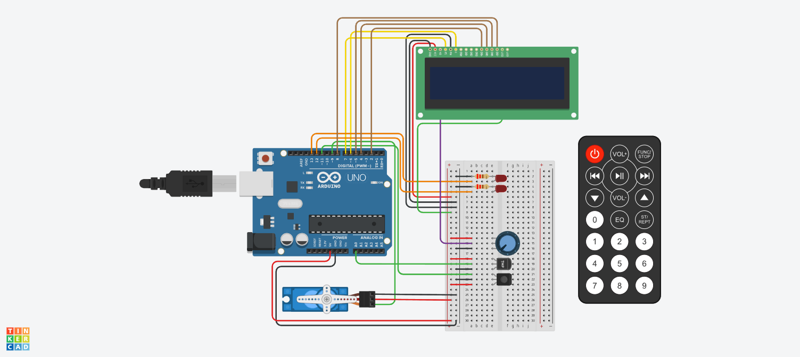

# Ejercicio parcial SPD Parte Practica Domiciliaria 
## Autor: Facundo Villoldo Yegros

Objetivo: 
El objetivo de este proyecto es diseñar un sistema de incendio utilizando Arduino que pueda
detectar cambios de temperatura y activar un servo motor en caso de detectar un incendio.
Además, se mostrará la temperatura actual y la estación del año en un display LCD.

Componentes necesarios:

1)Componentes necesarios:

    • Arduino UNO
    • Sensor de temperatura
    • Control remoto IR(Infrarrojo)
    • Display LCD (16x2 caracteres) 
    •Servo motor
    •Cables y resistencias según sea necesario
    •Protoboard para realizar las conexiones
    •Dos leds

2)Funcionamiento requeridos:

    • Conexiones:
    Conecta el sensor de temperatura al pin analógico A0 de Arduino.
    Conecta el control remoto IR al pin digital 11 de Arduino.
    Conecta el display LCD utilizando los pines correspondientes de Arduino.
    Conecta el servo motor a uno de los pines PWM de Arduino (por ejemplo, pin 9).

    • Control remoto:
    Configura el control remoto IR para recibir señales.
    Define los comandos necesarios para activar y desactivar el sistema de incendio.
    Utiliza un algoritmo para determinar la estación del año (por ejemplo, rangos de temperatura
    para cada estación).

    • Detección de temperatura:
    Configura el sensor de temperatura y realiza la lectura de la temperatura ambiente.
    Muestra la temperatura actual en el display LCD.

    • Sistema de alarma:
    Define un umbral de temperatura a partir del cual se considera que hay un incendio (por
    ejemplo, temperatura superior a 60 grados Celsius).
    Cuando se detecta un incendio (temperatura por encima del umbral), se activa el servo
    motor para simular una respuesta del sistema de incendio.

    • Mensajes en el display LCD:
    Muestra la temperatura actual y la estación del año en el display LCD.
    Cuando se detecta un incendio, muestra un mensaje de alarma en el display LCD.  

    • Punto libre::
    Se deberá agregar dos leds y darle una funcionalidad de su elección, acorde al
    proyecto previamente detallado.

3)Documentación:

    • Deberán presentar un diagrama esquemático del circuito y explicar el
    funcionamiento aplicado de cada componente.

    • Presentar el código fuente del proyecto de Arduino listo para ser
    implementado.

    • Deberán explicar el funcionamiento integral utilizando documentación
    MarkDown.

## Arduino:

## Codigo:

~~~ C++ 
//Librerias incluidas para el código
#include<LiquidCrystal.h>
#include<IRremote.h>
#include<Servo.h>

//Definiciones de pines y de variables
#define PRIMER_LED 13
#define SEGUNDO_LED 12
#define SEN_TEMP A0
#define codigo_encendido 0xFF00BF00
#define codigo_stop 0xFD02BF00
#define RECV_PIN 11

int temp_inciendo = 0;
int grados_anterior = 0;
int pase_temperatura = 0;
int celsius = 0;
String promedio_estacion;
LiquidCrystal lcd (7,6,2,4,5,8);
int posicion_servo = 0;
Servo servo_9; //definicion de servomotor

void setup(){
  //Configuro los leds
  pinMode(PRIMER_LED, OUTPUT);
  pinMode(SEGUNDO_LED, OUTPUT);
  
  //confuiguro el sensor de temperatura
  pinMode(SEN_TEMP, INPUT);
  
  //Configuro el sensor para que reciba señales infrarrojas
  IrReceiver.begin(RECV_PIN, DISABLE_LED_FEEDBACK);
  
  lcd.begin(16,2);
  servo_9.attach(9, 500, 2500);
  Serial.begin(9600);

}

void loop(){
  //Esta primera parte la use para que me muestre el codigo
  //De los botones de encendido y el botón de stop
  if (IrReceiver.decode())
  {
  	Serial.println("");
  	Serial.println("Codido de tecla es: ");
    Serial.println(IrReceiver.decodedIRData.decodedRawData); 
    IrReceiver.resume(); 
  }
  
  switch(IrReceiver.decodedIRData.decodedRawData)
  {
  	case 4278238976:
      //Calcular los grados celcius y colocar el valor de un incendio
      temp_inciendo = 60;
      pase_temperatura = (analogRead(SEN_TEMP)-20)*3.04;
      celsius = map(pase_temperatura, 0, 1023, -40, 125);

      lcd.setCursor(0,0);
      lcd.print("Temp:"+String(celsius)+"C");
      promedio_estacion = Estacion(celsius);
      lcd.setCursor(0,1);
      lcd.print("Estacion:"+String(promedio_estacion));
      delay(1000);
      lcd.clear();

      Leds_incendio(celsius);

      Alerta(celsius,temp_inciendo);
  }
}

void Alerta(int celsius, int temp_inciendo)
{
  if(celsius >= temp_inciendo)
  {
    //Muestro el mensaje de alerta
    lcd.print("ALERTA");
    lcd.setCursor(0,1);
    lcd.print("INCENDIO");
    
    //Se mueve el servo cuando hay un inciendo 
    for(posicion_servo = 0; posicion_servo <= 180; posicion_servo += 10){
      servo_9.write(posicion_servo);
      delay(20);
    }
    for(posicion_servo = 180; posicion_servo >= 0; posicion_servo -= 10){
      servo_9.write(posicion_servo);
      delay(20);
    }
    lcd.clear();
  }
}

String Estacion(int temperatura)
{
  //Este bloque de cogido lo uso para poder saber que estacion es.
  String estacion = "";
  if (temperatura >= 10 && temperatura <= 18)
  {
    estacion = "Otono";
    return estacion;
  }
  else
  {
    if (temperatura < 10)
    {
      estacion = "invierno";
      return estacion;
    }
    else
    {
      if (temperatura >= 19 && temperatura <= 22)
      {
        estacion = "primave.";
        return estacion;
      }
      else
      {
        if (temperatura >= 23)
        {
          estacion = "verano";
          return estacion;
        }
      }
    }
  }
}
void Leds_incendio(int temperatura)
{
  if(temperatura >= 60)
  {
    digitalWrite(PRIMER_LED, HIGH);
    digitalWrite(SEGUNDO_LED, HIGH);
    delay(250);
    digitalWrite(PRIMER_LED, LOW);
    digitalWrite(SEGUNDO_LED, LOW);
  }
}

~~~
